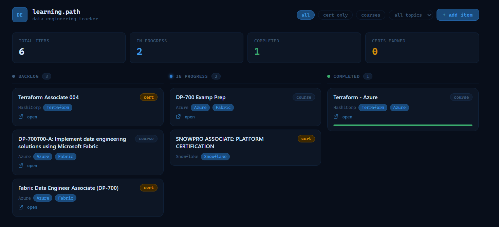

# learning.path


A super lightweight self-hosted learning path manager for data engineers. Deploy as a container and access from your browser.



## Directory structure

```
learning.path/
├── Dockerfile
├── docker-compose.yml
├── README.md
└── server/
    ├── server.js
    └── public/
        ├── index.html
        └── migrate.html
```

## Quick Start

1. Edit `docker-compose.yml` — set the volume path to your homelab data directory:
   ```yaml
   volumes:
     - /your/data/directory:/data
   ```

2. Deploy:
   ```bash
   docker compose up -d
   ```

3. Open http://localhost:8765

## docker-compose.yml reference

```yaml
services:
  de-learn-tracker:
    build: .
    container_name: de-learn-tracker
    restart: unless-stopped
    ports:
      - "8765:3000"      # change left side to use a different host port
    environment:
      - DATA_DIR=/data   # path inside the container — no need to change this
    volumes:
      - /your/data/directory:/data  # ← change this to your path
```

## Data File

Data is stored at `$DATA_DIR/learning.json` (default `/data/learning.json`) as a plain json file.
